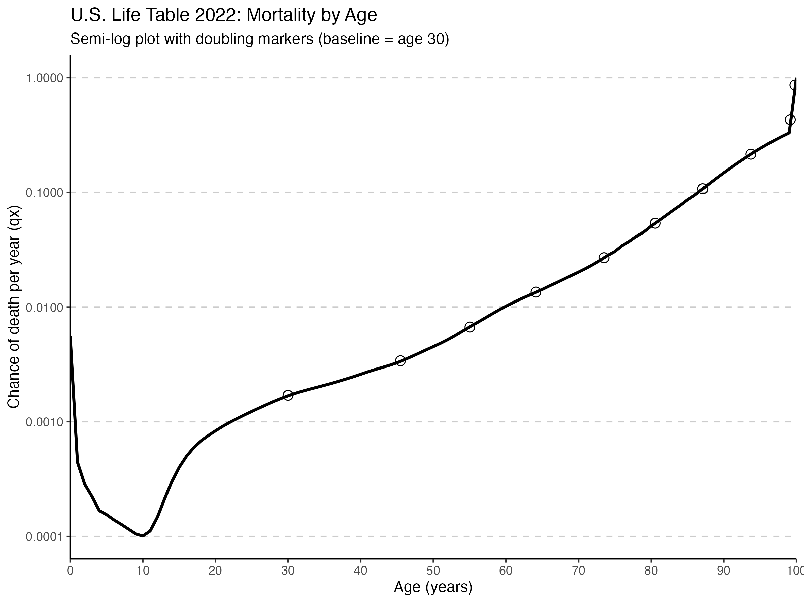
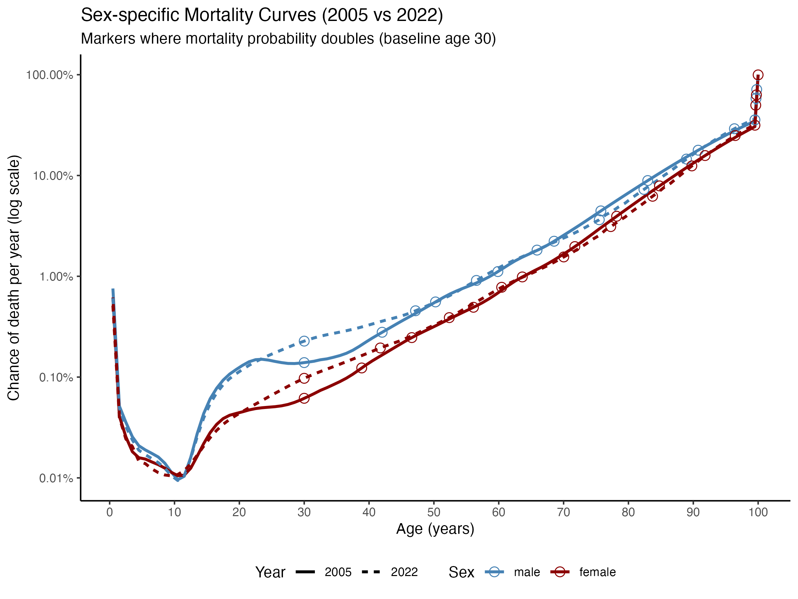
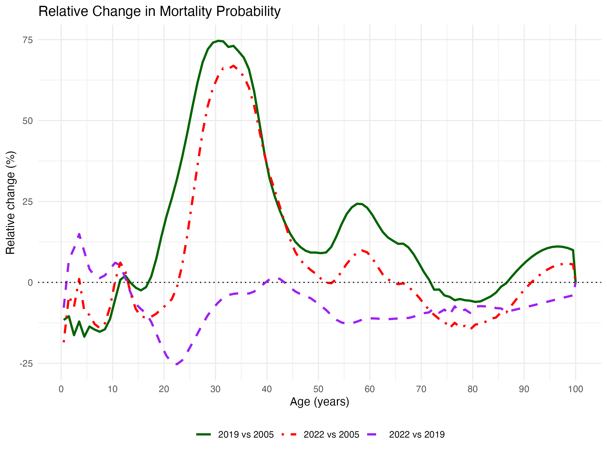

# Gompertz Law of Mortality

In 1825 it was observed that the probability of dying increases exponetially with advancing age. It works out to be doubling about every 8 years starting at about age 30: https://en.wikipedia.org/wiki/Gompertz–Makeham_law_of_mortality

### Code

Code to calculate and graph annual death probability

2022 CDC Life Table was pulled from here: ftp.cdc.gov/pub/Health_Statistics/NCHS/Publications/NVSR/74-02/table01.xlsx

### Doubling of Death Probability

Starting at age 30 (typically picked starting age)

| Age (years)| qx (chance per year)|
|-----------:|--------------------:|
|     30.0000|               0.0017|
|     45.4716|               0.0034|
|     55.0300|               0.0067|
|     64.1277|               0.0135|
|     73.5139|               0.0269|
|     80.5491|               0.0538|
|     87.1114|               0.1076|
|     93.7419|               0.2152|
|     99.1504|               0.4305|
|     99.7926|               0.8610|

The 2022 U.S. data show the Gompertz Law does not currently hold. Starting at age 30, it takes 15.47 years to double (which is well outside the about 8 years of the Gompertz Law). However, it only takes about 10 years to have the probability of death double from that at age 45.

Gompertz's Law appears to not hold true in 2022.

### Plot

## 2005 Versus 2022

What did the probabilities look like in the past?

| Age to double (2005)| qx (2005)| Age to double (2022)| qx (2022)|
|----------:|---------:|----------:|---------:|
|    30.0000|    0.0010|    30.0000|    0.0017|
|    40.6294|    0.0021|    45.4716|    0.0034|
|    48.9736|    0.0041|    55.0300|    0.0067|
|    58.4832|    0.0082|    64.1277|    0.0135|
|    66.9021|    0.0164|    73.5139|    0.0269|
|    74.2539|    0.0329|    80.5491|    0.0538|
|    81.1895|    0.0657|    87.1114|    0.1076|
|    88.5035|    0.1315|    93.7419|    0.2152|
|    96.6952|    0.2630|    99.1504|    0.4305|
|    99.3108|    0.5260|    99.7926|    0.8610|

Note: Age starts at 30 and the listed age is that where qx (probability of death) about doubles from the previous age (starting at 30).

By plotting data from 2005 versus 2022, we can see why the "Gompertz Law" does not hold true more recently through young to middle adulthood. Death probabilities were higher in 2022 relative to 2005 starting at about age 23 until age 65, with similar probabilities from about age 50 through 53. There are some slight improvements or similar rates from birth through about age 23 and then improvements between ages 66 though almost 90. Those later life "improvements" might partially be secondary to higher mortality risk in younger adulthood.

### Sex Stratified 2005 Versus 2022

One unknown is whether males and females had similar changes in risk of death. The data below show both sexes had increased probabilties of death, which demonstrates that whatever the causes are, they are not unique to males or females. "Gompertz Law" appears to hold more true for women than men.

2005 males: alpha = 0.0001, beta = 0.0796, doubling time = **8.71 yrs**

2005 females: alpha = 0.00004, beta = 0.0853, doubling time = **8.13 yrs**

2022 males: alpha = 0.0002, beta = 0.0654, doubling time = **10.60 yrs**

2022 females: alpha = 0.0001, beta = 0.0740, doubling time = **9.37 yrs**

## Differences Investigated: 2005, 2019, 2022

Let's look at more years. 2019 was added to capture the most recent data before the COVID-19 pandemic started.

**Gompertz parameters (30–80 yrs)**

2005: alpha = 0.0001, beta = 0.0810, doubling time = **8.6 yrs**

2019: alpha = 0.0002, beta = 0.0702, doubling time = **9.9 yrs**

2022: alpha = 0.0002, beta = 0.0680, doubling time = **10.2 yrs**

This clearly shows a slowing of mortality doubling time. The news is not good, however. As explained above and shown in the figure below, mortality rates are higher in the 23 to 65 age range in 2022 than they were in 2005. That's also true for 2019. That indicates that while the SARS-CoV-2 virus could be a factor in 2022, the data do not suggest it plays a major influence, considering mortality risk is generally lower after age 15 in 2022 than in 2019. There are many potential factors: increased suicides, drug abuse, factors associated with obesity, and more that could be affecting the rates in 2019 and 2022 relative to 2005.

