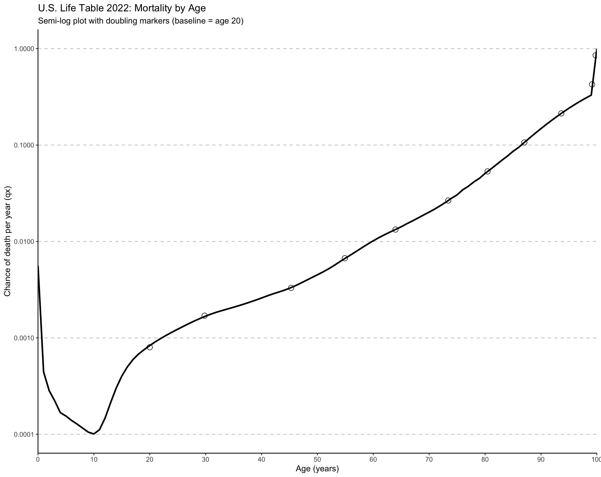
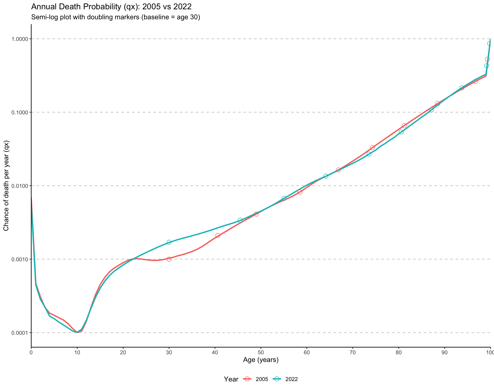

# Gompertz Law of Mortality

In 1825 it was observed that the probability of dying doubles about every 8 years starting at about age 30: https://en.wikipedia.org/wiki/Gompertz–Makeham_law_of_mortality

## Code

Code to calculate and graph annual death probability

2022 CDC Life Table was pulled from here: ftp.cdc.gov/pub/Health_Statistics/NCHS/Publications/NVSR/74-02/table01.xlsx

## Doubling of Death Probability

Starting at age 20 (arbitrarily picked)

| Age (years)| qx (chance per year)|
|-----------:|--------------------:|
|     20.0000|               0.0008|
|     29.8091|               0.0017|
|     45.2938|               0.0033|
|     54.9047|               0.0067|
|     63.9674|               0.0133|
|     73.4031|               0.0266|
|     80.4467|               0.0533|
|     87.0246|               0.1065|
|     93.6292|               0.2130|
|     99.1438|               0.4260|
|     99.7793|               0.8521|

The 2022 U.S. data show the Gompertz Law does not currently hold. Starting at age 20, it takes 9.8 years to double (which with within the about 8 years of the Gompertz Law). However, it takes about 15 years to have the probability of death double from that at age 30. In 2003 it took 10 years to double from the age 30 rate (https://www.cdc.gov/nchs/data/nvsr/nvsr54/nvsr54_14.pdf), which was 0.001008. In 2022 that rate was 0.001682, which is a significant increase.

40 year olds in 2003: 0.002038

40 year olds in 2022: 0.002593

Gompertz's Law appears to not hold true in part through young to middle adulthood becuase of increases in mortality in that age range.

## Plot

## 2005 Versus 2022

By plotting data from 2005 versus 2022, we can see why the "Gompertz Law" does not hold true more recently through young to middle adulthood. Death probabilities were higher in 2022 relative to 2005 starting at about age 25 until age 50. There are some slight improvements between ages 4-10 and about 67 though almost 90.

