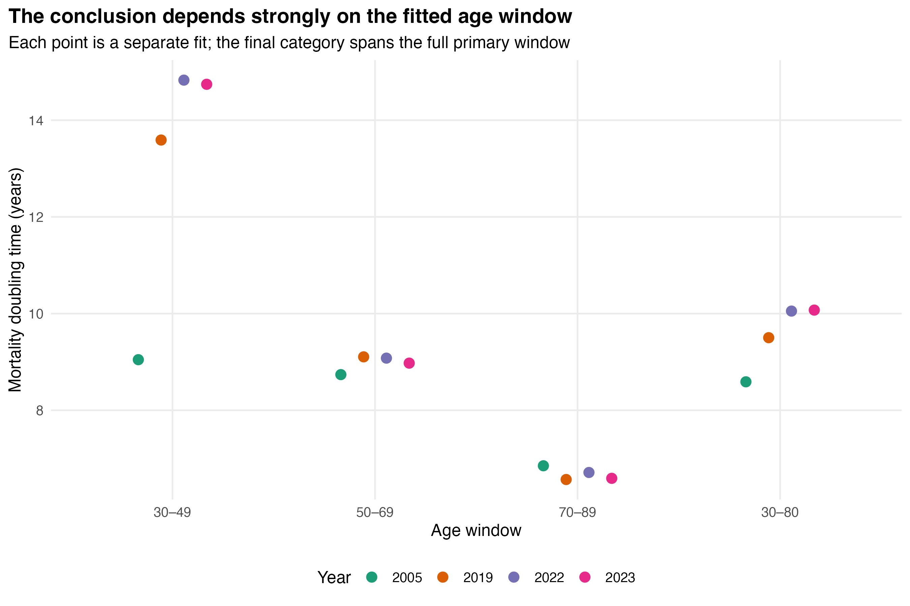
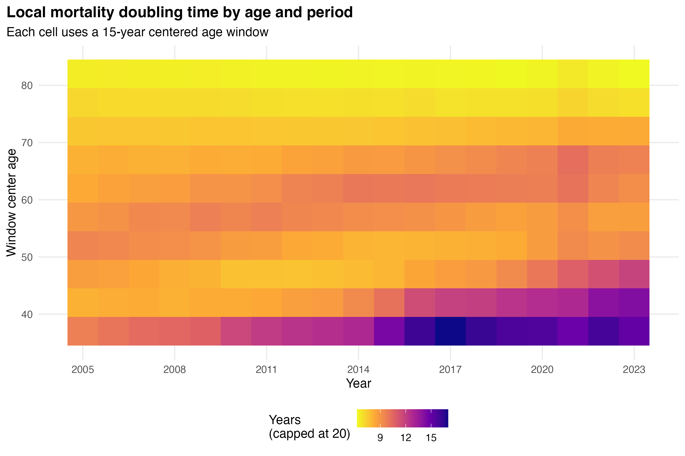
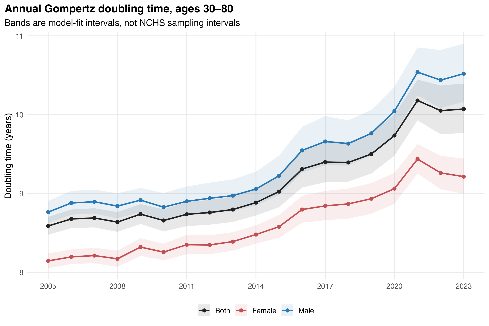
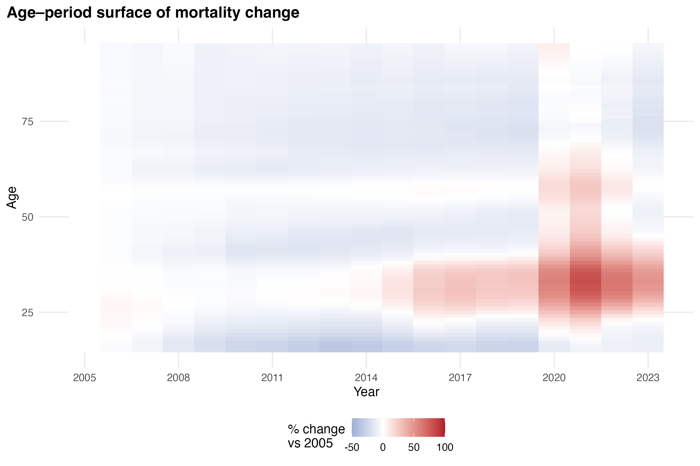
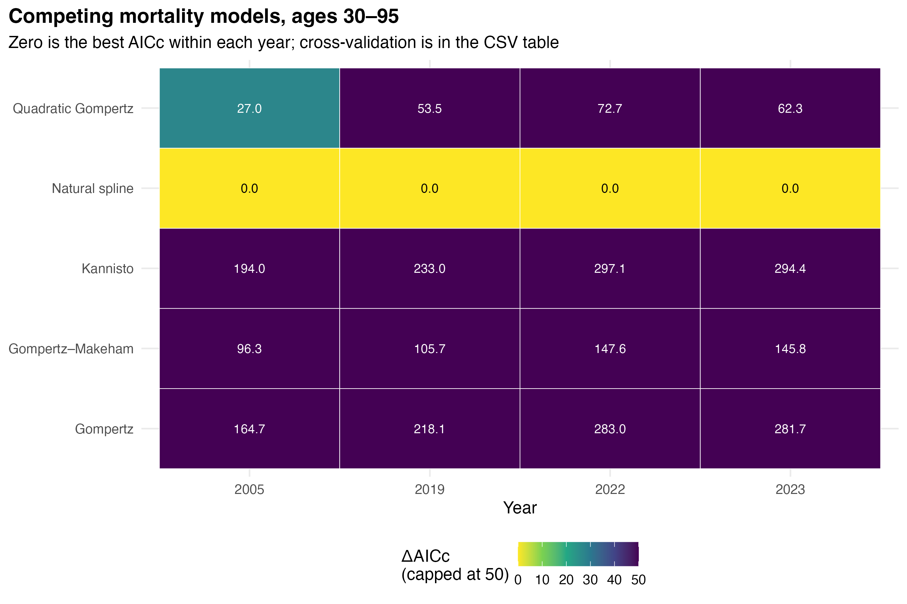
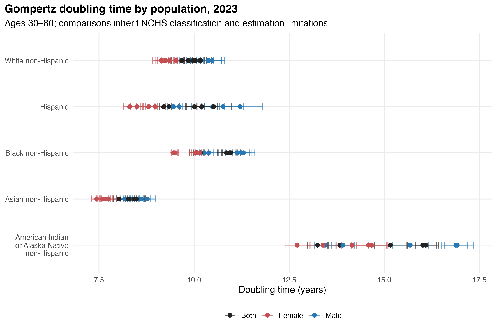
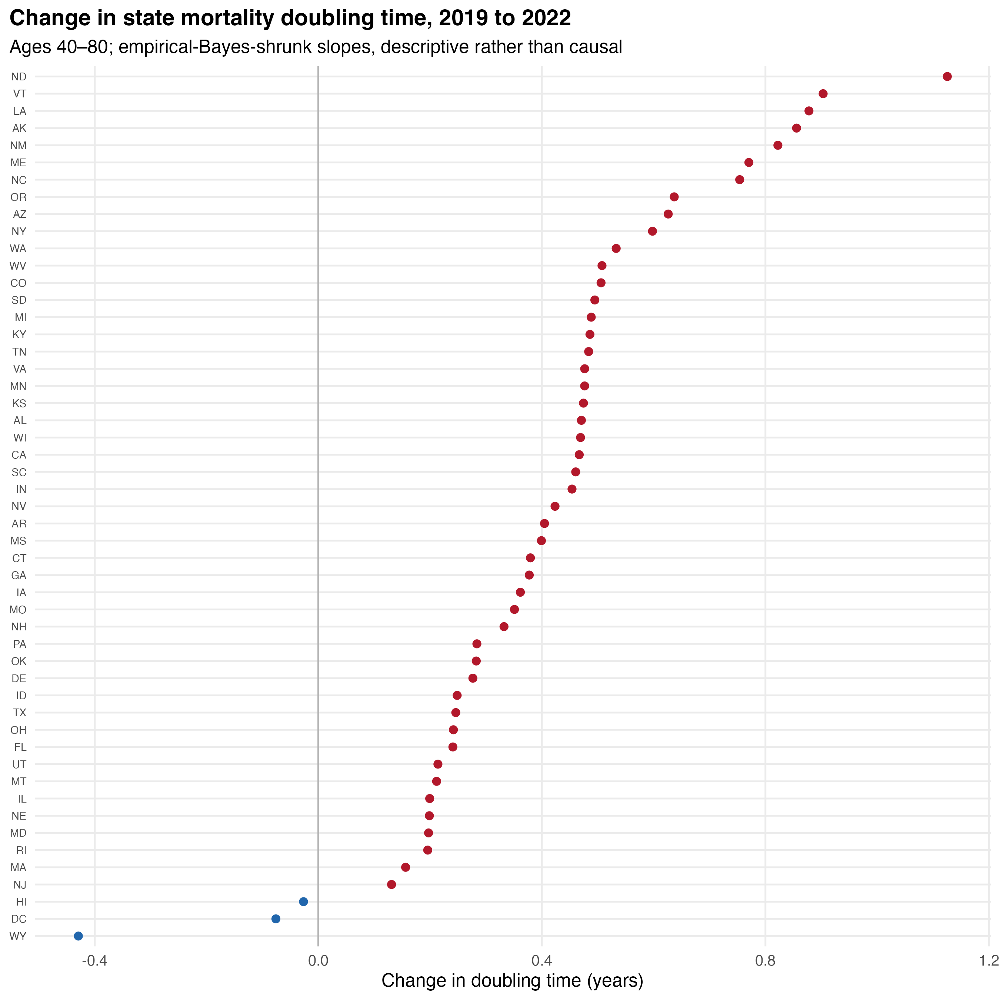
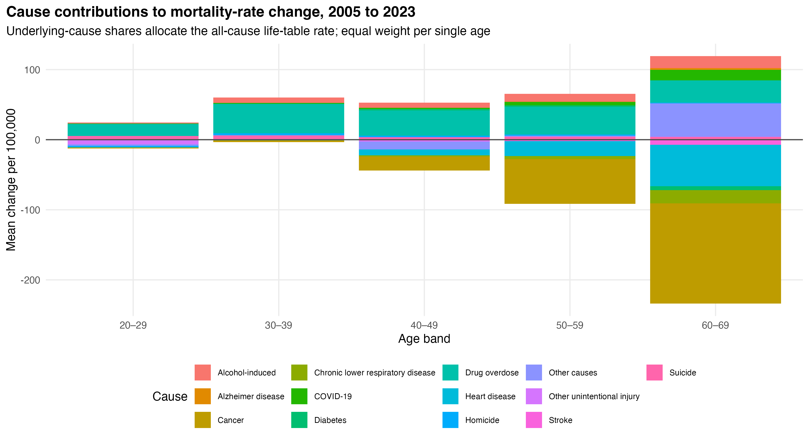
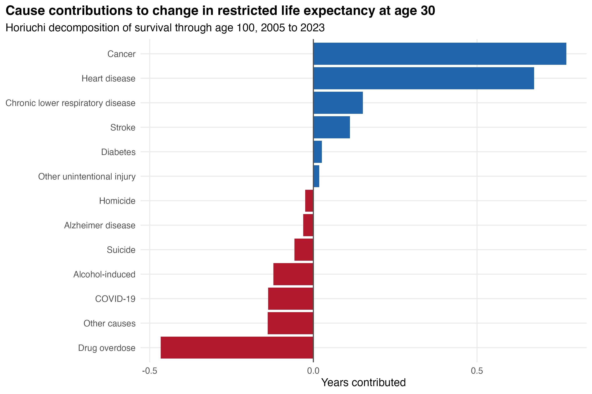

Gompertz: U.S. Adult Mortality, 2005–2023
================

- [Main findings](#main-findings)
- [Statistical approach](#statistical-approach)
- [Reproduce everything](#reproduce-everything)
- [Repository layout](#repository-layout)
- [Data sources and citation](#data-sources-and-citation)

[](https://github.com/tannerjared/Gompertz/actions/workflows/rebuild.yml)

This project asks a more precise question than whether mortality
“doubles every eight years”:

> At what ages, in which periods and populations, and for which
> underlying causes has the acceleration of U.S. mortality changed?

The repository downloads official U.S. life tables, reconstructs a tidy
analysis dataset, fits competing mortality models, examines age-window
sensitivity, compares demographic groups and states, and decomposes
mortality change by underlying cause of death. Every table and figure
below is generated by the pipeline.

## Main findings

### One 30–80 slope conceals substantial age variation

Across ages 30–80, the fitted Gompertz doubling time increased from 8.6
years in 2005 to 10.1 years in 2023. That summary is mathematically
correct for the selected interval but is not uniform across adulthood.

| Age window | 2005      | 2019       | 2022       | 2023       |
|:-----------|:----------|:-----------|:-----------|:-----------|
| 30–49      | 9.0 years | 13.6 years | 14.8 years | 14.7 years |
| 50–69      | 8.7 years | 9.1 years  | 9.1 years  | 9.0 years  |
| 70–89      | 6.9 years | 6.6 years  | 6.7 years  | 6.6 years  |
| 30–80      | 8.6 years | 9.5 years  | 10.1 years | 10.1 years |

<figure>

<figcaption aria-hidden="true">Age-window sensitivity</figcaption>
</figure>

The major departure from the earlier curve is concentrated in younger
adulthood. Later-adult slopes are much more stable. This makes a
moving-window or age-segmented description more informative than a
single “law” fitted over 50 years of age.

<figure>

<figcaption aria-hidden="true">Local doubling-time heatmap</figcaption>
</figure>

### The annual series shows when the divergence emerged

The original repository compared three years. This rebuild uses every
final national life table from 2005 through 2023, including revised
intercensal tables for 2005–2009.

<figure>

<figcaption aria-hidden="true">Annual doubling time</figcaption>
</figure>

<figure>

<figcaption aria-hidden="true">Age-period change</figcaption>
</figure>

The heatmap emphasizes why period and age must be considered together: a
slower fitted slope can occur because mortality rose at the younger end
of the fitting interval, not because mortality improved more slowly at
every adult age.

### Gompertz is a useful summary, not a universal fit

The analysis compares Gompertz, Gompertz–Makeham, quadratic Gompertz,
Kannisto, and a four-degree-of-freedom natural spline over ages 30–95.
Models are evaluated with corrected AIC and five-fold held-out-age
prediction error; the complete values are in
[`model_comparison.csv`](output/tables/model_comparison.csv).

<figure>

<figcaption aria-hidden="true">Model comparison</figcaption>
</figure>

A high R² for a straight line on log mortality is not, by itself,
evidence that curvature or late-age deceleration is absent. The residual
and predictive comparisons explicitly test that assumption.

### Sex and population patterns are heterogeneous

NCHS has published annual life tables for five race/Hispanic-origin
populations, by sex, since 2019. These classifications and the
associated adjustments are properties of the official life tables and
should not be interpreted as biological categories.

<figure>

<figcaption aria-hidden="true">Subgroup estimates</figcaption>
</figure>

### Geographic variation is substantial

The state analysis fits ages 40–80 in the 2019 and 2022 state life
tables. Because small states have noisier curves, the displayed slopes
use a transparent normal–normal empirical-Bayes shrinkage step. It is
descriptive and is not a causal state ranking.

<figure>

<figcaption aria-hidden="true">State change</figcaption>
</figure>

### Underlying causes explain the younger-adult change

The cause analysis reads the NCHS mortality public-use files directly
for 2005, 2019, 2022, and 2023. Mutually exclusive underlying-cause
categories are used to allocate the corresponding all-cause life-table
mortality rate at each age. This tests proposed explanations rather than
inferring them from the shape of the all-cause curve.

<figure>

<figcaption aria-hidden="true">Cause-specific rate change</figcaption>
</figure>

The project also applies a Horiuchi stepwise-replacement decomposition
to restricted remaining life expectancy from age 30 through age 100.
Positive bars contributed to improvement from 2005 to 2023; negative
bars offset it.

<figure>

<figcaption aria-hidden="true">Life-expectancy
decomposition</figcaption>
</figure>

The numerical decomposition is in
[`life_expectancy_decomposition_2005_2023.csv`](output/tables/life_expectancy_decomposition_2005_2023.csv).
It is a decomposition of period mortality rates, not proof that any
cause produced another cause or any individual outcome.

## Statistical approach

The published life-table quantity `qx` is the probability of dying
between ages *x* and *x + 1*. Gompertz describes a mortality rate or
hazard. For adult single-year intervals, the pipeline uses the inverse
of the NCHS life-table relationship:

$$m_x = \frac{q_x}{1 - q_x/2}.$$

The primary summary fits

$$\log(m_x) = \log(m_{50}) + \beta(x - 50),
\qquad T_2 = \frac{\log 2}{\beta},$$

where centering at age 50 makes the intercept interpretable. The primary
window is 30–80 for continuity with the original project, but every
conclusion is accompanied by prespecified age-window and rolling-window
sensitivity analyses.

Important qualifications:

- The intervals around slopes and doubling times measure lack of fit
  across ages. They are not official NCHS sampling intervals.
- The `100 and over` row has `qx = 1` because it is open-ended. It is
  excluded from annual-rate models and threshold interpolation.
- Period life tables describe a synthetic cohort exposed to one period’s
  age-specific rates. They do not follow the same people as they age.
- Cause categories are based on the single underlying cause recorded on
  the death certificate. Multiple-cause analyses can answer different
  questions.
- State shrinkage and subgroup comparisons are descriptive; they do not
  adjust for compositional or contextual confounding.

## Reproduce everything

Requirements are R 4.3 or later, `curl`, `unzip`, and `awk`. The release
was built with R 4.6.1, and all package versions are recorded in
`renv.lock`; continuous integration also uses R 4.6.1.

``` r
install.packages("renv")
renv::restore()
targets::tar_make()
testthat::test_dir("tests/testthat")
```

The regular build downloads about 5–10 MB of official spreadsheets and
recreates every derived dataset, table, figure, the README, and
[`analysis/report.html`](analysis/report.html).

The committed `data-raw/cause_counts.csv` is a non-identifying aggregate
created from roughly 500 MB of official mortality public-use archives.
To rebuild that file from the original archives:

``` r
source("scripts/rebuild_causes.R")
targets::tar_make()
```

Set `NCHS_INSECURE_SSL=true` only if an institutional machine has an
incomplete certificate chain for `ftp.cdc.gov`; the default keeps
certificate verification enabled.

## Repository layout

``` text
R/                         import, modeling, decomposition, and plotting functions
config/                    prespecified years, age windows, groups, and source URLs
data-raw/                  aggregate cause counts and source checksum manifests
data/derived/              pipeline-generated tidy analysis datasets
output/figures/            publication-ready figures
output/tables/             complete numerical results
analysis/report.Rmd        full methods and results report
tests/testthat/            data and statistical regression tests
_targets.R                 end-to-end dependency graph
renv.lock                  exact R dependency versions
.github/workflows/         clean rebuild and test workflow
```

See [`DATA_SOURCES.md`](DATA_SOURCES.md) for provenance, revision
choices, access dates, and redistribution notes. Optional cohort and
international analysis functions accept licensed Human Mortality
Database `Mx_1x1` files placed in `data-raw/hmd/`; HMD source files are
not redistributed by this repository.

## Data sources and citation

- National Center for Health Statistics, [U.S. Life
  Tables](https://www.cdc.gov/nchs/products/life_tables.htm), 2005–2023.
- National Center for Health Statistics, [U.S. State Life
  Tables](https://www.cdc.gov/nchs/products/life_tables.htm), 2019 and
  2022.
- National Center for Health Statistics, [Mortality Multiple Cause
  public-use
  files](https://www.cdc.gov/nchs/data_access/vitalstatsonline.htm),
  selected years 2005–2023.
- Human Mortality Database, [methods
  protocol](https://www.mortality.org/File/GetDocument/Public/Docs/MethodsProtocolV6.pdf),
  for optional licensed cohort and international extensions.

Code is released under the MIT License. U.S. government source data are
public domain; users remain responsible for following the source
agencies’ citation and data-use guidance.
