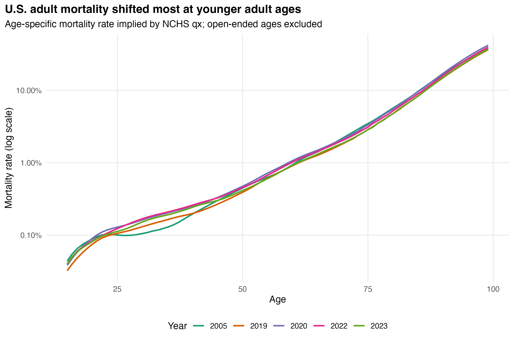

```{r setup, include=FALSE}
knitr::opts_chunk$set(echo = FALSE, message = FALSE, warning = FALSE,
                      fig.width = 10, fig.height = 6)
library(dplyr)
library(readr)
library(tidyr)
library(ggplot2)
library(knitr)
annual <- read_csv("../output/tables/annual_gompertz_fits.csv", show_col_types = FALSE)
windows <- read_csv("../output/tables/age_window_sensitivity.csv", show_col_types = FALSE)
rolling <- read_csv("../output/tables/rolling_gompertz_fits.csv", show_col_types = FALSE)
models <- read_csv("../output/tables/model_comparison.csv", show_col_types = FALSE)
states <- read_csv("../output/tables/state_gompertz_fits.csv", show_col_types = FALSE)
cause_rates <- read_csv("../output/tables/cause_rate_decomposition_2005_2023.csv", show_col_types = FALSE)
life_decomp <- read_csv("../output/tables/life_expectancy_decomposition_2005_2023.csv", show_col_types = FALSE)
```

# Abstract

The Gompertz law is often summarized as an approximately exponential increase in adult mortality with age. A single doubling-time estimate, however, can conceal changes concentrated at only one end of the fitted age interval. We assembled final National Center for Health Statistics period life tables for every year from 2005 through 2023, including sex-specific tables, population-specific tables for 2019–2023, and state tables for 2019 and 2022. We converted annual death probabilities to their implied mortality rates, fitted prespecified age-window and rolling-window models, compared five functional forms, and allocated mortality-rate changes to mutually exclusive underlying-cause groups using selected NCHS mortality public-use files. We additionally decomposed the 2005–2023 change in restricted remaining life expectancy at age 30 by age and cause. The primary result is that the increase in a single ages-30–80 doubling time is driven predominantly by younger-adult mortality; the slope at later adult ages is considerably more stable. These are descriptive period analyses and do not identify individual or causal aging mechanisms.

# Data

## National life tables

The national panel includes complete annual tables for 2005–2023. Revised intercensal versions are used for 2005–2009. Tables 1–3 provide total, male, and female estimates in every year. Beginning in 2019, Tables 4–18 add Hispanic, American Indian or Alaska Native non-Hispanic, Asian non-Hispanic, Black non-Hispanic, and White non-Hispanic populations, each for both sexes and separately for males and females.

NCHS `qx` is the probability of death in the interval from exact age *x* to *x + 1*. It is converted to the implied central mortality rate using the adult one-year-interval relationship

\[
m_x = q_x/(1-q_x/2).
\]

The open interval at age 100 and older is excluded because `qx = 1` there is an interval-closing convention rather than a one-year probability.

## State life tables

Total-population state tables for 2019 and 2022 cover the 50 states and District of Columbia. State results are fitted over ages 40–80 and partially pooled with a normal–normal empirical-Bayes estimator. This reduces extreme descriptive rankings produced by imprecise curves in smaller states.

## Underlying causes

The 2005, 2019, 2022, and 2023 public-use mortality files were aggregated by single year of age, sex, and a broad underlying-cause category. The aggregate includes no record-level or subnational information. Underlying-cause shares at each age, sex, and period allocate the matching all-cause life-table rate. The resulting components add exactly to the all-cause rate within rounding error.

# Methods

## Gompertz summaries and sensitivity

The primary model is

\[
\log(m_x)=\log(m_{50})+\beta(x-50),
\]

fitted over ages 30–80. Mortality doubling time is `log(2)/beta`. Centering age at 50 gives the intercept a useful interpretation and avoids presenting an extrapolated age-zero baseline from an adult-only model.

Prespecified windows are 30–49, 50–69, 70–89, 30–80, 40–85, and 50–90. Rolling summaries use 15-year windows centered from age 37 to 82. Regression intervals are used as diagnostics for model fit across ages; they are not NCHS sampling confidence intervals.

## Competing models

Five models are compared over ages 30–95: Gompertz, Gompertz–Makeham, quadratic Gompertz, Kannisto, and a four-degree-of-freedom natural spline. All use Gaussian residuals on log mortality so AICc values are comparable. Five-fold held-out-age log-RMSE provides a predictive check alongside AICc and the maximum absolute log residual.

## Cause and survival decomposition

For ages 20–69, the displayed cause contribution is the mean of the single-age mortality-rate differences within each decade. This gives every single age equal weight and should not be confused with direct age standardization.

For survival, we calculate restricted remaining life expectancy at age 30 through age 100 and apply the Horiuchi stepwise-replacement algorithm to age-by-cause mortality components. Fifty integration steps make the component sum numerically equal to the total survival change to high precision.

# Results

## Period mortality curves



The separation between 2005 and later periods is visibly greatest at younger adult ages. The apparent convergence at older adult ages motivates the age-window analysis.

## Annual primary estimates


```{r annual-table}
annual |>
  filter(population == "Total", sex == "Both", year %in% c(2005, 2010, 2015, 2019, 2020, 2021, 2022, 2023)) |>
  transmute(
    Year = year,
    `Mortality at 50` = sprintf("%.5f", mortality_at_center),
    Beta = sprintf("%.4f", beta),
    `Doubling time` = sprintf("%.2f", doubling_time),
    `R-squared` = sprintf("%.4f", r_squared)
  ) |>
  kable()
```

## Age-window sensitivity


```{r window-table}
windows |>
  filter(population == "Total", sex == "Both",
         year %in% c(2005, 2019, 2022, 2023),
         window %in% c("30–49", "50–69", "70–89", "30–80")) |>
  select(year, window, doubling_time) |>
  mutate(doubling_time = round(doubling_time, 2)) |>
  pivot_wider(names_from = year, values_from = doubling_time) |>
  kable(caption = "Mortality doubling time in years")
```


Together these diagnostics show that “the doubling time slowed” is incomplete. The slope changed most in windows containing younger-adult ages, while later-adult windows changed less and sometimes in the opposite direction.

## Functional-form assessment


```{r model-table}
models |>
  group_by(year) |>
  arrange(aicc_rank, .by_group = TRUE) |>
  slice_head(n = 2) |>
  ungroup() |>
  transmute(Year = year, Model = model, `Delta AICc` = round(delta_aicc, 2),
            `CV log-RMSE` = round(cv_rmse_log, 4)) |>
  kable(caption = "Two best AICc models in each selected year")
```

The model comparison guards against interpreting a visually high linear R-squared as universal Gompertz behavior. A flexible model can improve fit while the Gompertz slope remains useful as a standardized summary.

## Population and sex


Differences describe the official period tables. They combine historical, social, environmental, health-care, compositional, measurement, and other processes; they should not be assigned a biological interpretation from this analysis.

## States


State-level changes are heterogeneous. Because only two state years are analyzed, these estimates should be treated as descriptive signals for further study rather than stable trends.

## Underlying causes


The all-cause change at younger adult ages is not attributable to a generic shift in aging alone. External and behavioral causes make identifiable contributions, while changes in major natural causes differ across age bands.


```{r cause-table}
life_decomp |>
  group_by(cause) |>
  summarise(`Years contributed` = sum(years_contributed), .groups = "drop") |>
  arrange(`Years contributed`) |>
  mutate(`Years contributed` = round(`Years contributed`, 3)) |>
  kable(caption = "Cause contributions to 2005–2023 change in restricted remaining life expectancy at age 30")
```

# Period versus cohort interpretation

These are period life tables. The rate at age 30 in 2023 and the rate at age 80 in 2023 apply to different birth cohorts observed in the same calendar period. Consequently, lower childhood mortality in one period cannot mechanically explain higher age-30 mortality in that same period table. Frailty selection and cohort explanations require cohort data.

`R/hmd.R` implements period and birth-cohort fits for standard Human Mortality Database `Mx_1x1` files. HMD files are not bundled because access requires an account and is governed by separate terms. When authorized files are placed under `data-raw/hmd/`, the pipeline writes `hmd_period_fits.csv` and `hmd_cohort_fits.csv` without changing the core analysis.

# Limitations

1. Published NCHS life tables are constructed estimates using smoothing, census populations, vital records, and specialized older-age methods. Adjacent ages are not independent raw observations.
2. Regression intervals quantify lack of fit across ages rather than full uncertainty in the mortality system.
3. Race and Hispanic-origin categories, classification ratios, and comparability change over time; subgroup analysis is therefore restricted to 2019 onward.
4. The cause allocation uses underlying cause only. Multiple-cause files contain additional contributing conditions not analyzed here.
5. The cause-specific survival decomposition combines life-table rates with death-certificate cause shares; it is internally additive but remains a descriptive approximation.
6. Period, state, and subgroup comparisons cannot establish causality.

# Reproducibility

The complete source manifest, downloaded-file hashes, aggregate-microdata hashes, exact package versions, automated tests, and continuous-integration workflow are included in the repository. The analysis is rebuilt with one command:

```r
targets::tar_make()
```

See `DATA_SOURCES.md` and the machine-readable CSV outputs for complete provenance and numerical results.

